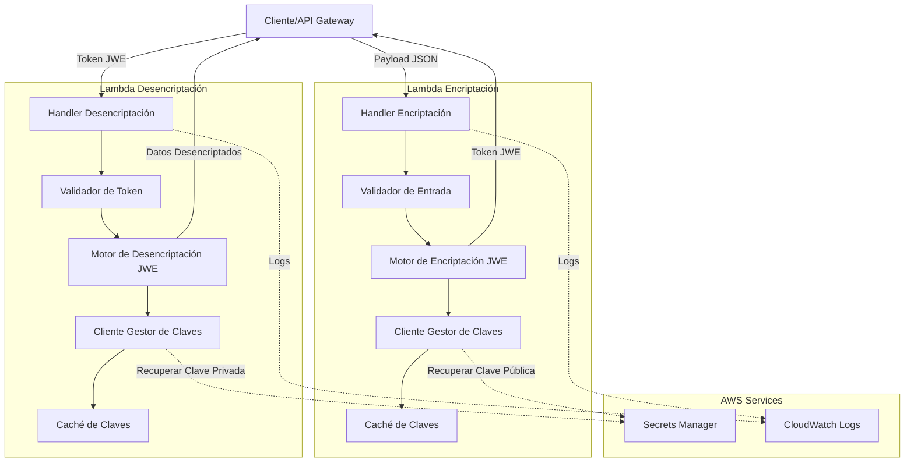

# Documento de Diseño

## Visión General

Este documento describe el diseño técnico de un sistema de encriptación/desencriptación serverless compuesto por dos funciones AWS Lambda independientes implementadas en Node.js. El sistema proporciona capacidades de encriptación usando JWT-JWE (JSON Web Encryption) con algoritmos RSA-OAEP-256 y A256GCM, siguiendo los estándares RFC 7516 y RFC 7517.

### Objetivos del Diseño

- **Seguridad**: Implementar encriptación robusta usando estándares de la industria
- **Separación de responsabilidades**: Funciones Lambda independientes para encriptación y desencriptación
- **Resiliencia**: Manejo robusto de errores con reintentos y backoff exponencial
- **Observabilidad**: Logging estructurado sin exponer datos sensibles
- **Rendimiento**: Operaciones de encriptación/desencriptación en menos de 1 segundo

### Tecnologías Principales

- **Runtime**: Node.js 18.x o superior
- **Librería JWE**: `jose` (librería estándar para JWT/JWE en Node.js)
- **Gestor de Claves**: AWS Secrets Manager o AWS Systems Manager Parameter Store
- **Logging**: CloudWatch Logs con formato JSON estructurado

## Arquitectura

### Diagrama de Componentes



### Flujo de Encriptación

1. **Recepción**: Lambda recibe evento con payload JSON
2. **Validación**: Validar formato, tamaño (≤6MB) y contenido del payload
3. **Recuperación de Clave**: Obtener clave pública desde caché o Secrets Manager
4. **Encriptación**: Crear token JWE usando RSA-OAEP-256 + A256GCM
5. **Respuesta**: Retornar token JWE en formato compacto
6. **Logging**: Registrar métricas sin exponer datos sensibles

### Flujo de Desencriptación

1. **Recepción**: Lambda recibe evento con token JWE
2. **Validación**: Validar formato JWE (5 partes) y algoritmos
3. **Recuperación de Clave**: Obtener clave privada desde caché o Secrets Manager
4. **Desencriptación**: Extraer y descifrar payload original
5. **Respuesta**: Retornar datos desencriptados en formato JSON
6. **Logging**: Registrar métricas sin exponer datos sensibles

### Decisiones Arquitectónicas

**1. Funciones Lambda Separadas**
- **Decisión**: Implementar encriptación y desencriptación como funciones independientes
- **Razón**: Principio de mínimo privilegio (cada función solo accede a su clave), mejor aislamiento de seguridad, escalado independiente

**2. Librería `jose` para JWE**
- **Decisión**: Usar la librería `jose` en lugar de implementación custom
- **Razón**: Librería estándar mantenida activamente, cumple RFC 7516/7517, API moderna con soporte async/await, ampliamente auditada

**3. Caché de Claves en Memoria**
- **Decisión**: Cachear claves durante el ciclo de vida del contenedor Lambda
- **Razón**: Reducir latencia y costos de llamadas a Secrets Manager, aprovechar warm starts de Lambda

**4. Secrets Manager para Gestión de Claves**
- **Decisión**: Usar AWS Secrets Manager como gestor de claves predeterminado
- **Razón**: Rotación automática de secretos, auditoría integrada, cifrado en reposo, control de acceso granular con IAM

## Componentes e Interfaces

### Lambda de Encriptación

#### Handler Principal

```typescript
interface EncryptionEvent {
  body: string;  // JSON stringificado del payload
  headers?: Record<string, string>;
  requestContext?: {
    requestId: string;
  };
}

interface EncryptionResponse {
  statusCode: number;
  headers: {
    'Content-Type': string;
  };
  body: string;  // JSON stringificado con { token: string } o { error: string }
}

async function handler(event: EncryptionEvent): Promise<EncryptionResponse>
```

**Responsabilidades**:
- Parsear y validar el evento de entrada
- Coordinar validación, encriptación y respuesta
- Manejar errores y retornar respuestas HTTP apropiadas
- Registrar métricas de invocación

#### Validador de Entrada

```typescript
interface ValidationResult {
  valid: boolean;
  error?: string;
  payload?: any;
}

class InputValidator {
  validatePayload(body: string): ValidationResult;
  checkPayloadSize(body: string): boolean;
  checkPayloadContent(payload: any): boolean;
}
```

**Responsabilidades**:
- Validar que el body sea JSON válido
- Verificar tamaño ≤6MB
- Verificar que contenga al menos un campo con datos
- Retornar errores descriptivos

#### Motor de Encriptación

```typescript
interface EncryptionOptions {
  algorithm: 'RSA-OAEP-256';
  encryption: 'A256GCM';
}

class JWEEncryptor {
  constructor(publicKey: JsonWebKey);
  
  async encrypt(payload: any): Promise<string>;
  validateKey(key: JsonWebKey): boolean;
}
```

**Responsabilidades**:
- Encriptar payload usando `jose` library
- Configurar algoritmos RSA-OAEP-256 y A256GCM
- Generar token JWE en formato compacto
- Validar formato de clave pública

#### Cliente Gestor de Claves (Encriptación)

```typescript
interface KeyManagerConfig {
  secretName: string;
  region: string;
  maxRetries: 3;
  retryDelay: number;  // ms, con backoff exponencial
}

class KeyManager {
  private cache: Map<string, JsonWebKey>;
  
  async getPublicKey(keyId: string): Promise<JsonWebKey>;
  private async fetchFromSecretsManager(keyId: string): Promise<JsonWebKey>;
  private async retryWithBackoff<T>(fn: () => Promise<T>): Promise<T>;
}
```

**Responsabilidades**:
- Recuperar clave pública desde Secrets Manager
- Implementar caché en memoria durante ciclo de vida del contenedor
- Reintentar hasta 3 veces con backoff exponencial (100ms, 200ms, 400ms)
- Validar formato JWK de la clave

### Lambda de Desencriptación

#### Handler Principal

```typescript
interface DecryptionEvent {
  body: string;  // JSON stringificado con { token: string }
  headers?: Record<string, string>;
  requestContext?: {
    requestId: string;
  };
}

interface DecryptionResponse {
  statusCode: number;
  headers: {
    'Content-Type': string;
  };
  body: string;  // JSON stringificado con datos desencriptados o { error: string }
}

async function handler(event: DecryptionEvent): Promise<DecryptionResponse>
```

**Responsabilidades**:
- Parsear y validar el evento de entrada
- Coordinar validación, desencriptación y respuesta
- Manejar errores y retornar respuestas HTTP apropiadas
- Registrar métricas de invocación

#### Validador de Token

```typescript
interface TokenValidationResult {
  valid: boolean;
  error?: string;
  token?: string;
}

class TokenValidator {
  validateJWEFormat(token: string): TokenValidationResult;
  validateAlgorithms(token: string): boolean;
}
```

**Responsabilidades**:
- Validar formato compacto JWE (5 partes separadas por puntos)
- Verificar que el header contenga alg: RSA-OAEP-256 y enc: A256GCM
- Retornar errores descriptivos

#### Motor de Desencriptación

```typescript
class JWEDecryptor {
  constructor(privateKey: JsonWebKey);
  
  async decrypt(token: string): Promise<any>;
  validateKey(key: JsonWebKey): boolean;
}
```

**Responsabilidades**:
- Desencriptar token JWE usando `jose` library
- Extraer payload original
- Validar formato de clave privada
- Manejar errores de desencriptación

#### Cliente Gestor de Claves (Desencriptación)

```typescript
class KeyManager {
  private cache: Map<string, JsonWebKey>;
  
  async getPrivateKey(keyId: string): Promise<JsonWebKey>;
  private async fetchFromSecretsManager(keyId: string): Promise<JsonWebKey>;
  private async retryWithBackoff<T>(fn: () => Promise<T>): Promise<T>;
  private sanitizeKeyForLogging(key: JsonWebKey): string;
}
```

**Responsabilidades**:
- Recuperar clave privada desde Secrets Manager
- Implementar caché en memoria durante ciclo de vida del contenedor
- Reintentar hasta 3 veces con backoff exponencial
- Asegurar que la clave privada nunca se registre en logs

### Componentes Compartidos

#### Logger

```typescript
enum LogLevel {
  DEBUG = 'DEBUG',
  INFO = 'INFO',
  WARN = 'WARN',
  ERROR = 'ERROR'
}

interface LogContext {
  requestId: string;
  timestamp: string;
  functionName: string;
  [key: string]: any;
}

class Logger {
  constructor(level: LogLevel);
  
  info(message: string, context?: LogContext): void;
  error(message: string, error: Error, context?: LogContext): void;
  warn(message: string, context?: LogContext): void;
  debug(message: string, context?: LogContext): void;
  
  private sanitize(data: any): any;  // Remover datos sensibles
}
```

**Responsabilidades**:
- Logging estructurado en formato JSON
- Sanitizar datos sensibles (payloads, tokens, claves)
- Incluir contexto (requestId, timestamp, función)
- Soportar niveles de log configurables

#### Error Handler

```typescript
enum ErrorType {
  VALIDATION_ERROR = 'VALIDATION_ERROR',
  ENCRYPTION_ERROR = 'ENCRYPTION_ERROR',
  DECRYPTION_ERROR = 'DECRYPTION_ERROR',
  KEY_RETRIEVAL_ERROR = 'KEY_RETRIEVAL_ERROR',
  TIMEOUT_ERROR = 'TIMEOUT_ERROR',
  INTERNAL_ERROR = 'INTERNAL_ERROR'
}

interface AppError {
  type: ErrorType;
  message: string;
  statusCode: number;
  details?: any;
}

class ErrorHandler {
  static handle(error: Error | AppError): EncryptionResponse | DecryptionResponse;
  static createValidationError(message: string): AppError;
  static createInternalError(message: string): AppError;
}
```

**Responsabilidades**:
- Mapear errores a códigos HTTP apropiados
- Generar mensajes de error seguros (sin exponer detalles internos)
- Logging de errores con contexto
- Estandarizar formato de respuestas de error

## Modelos de Datos

### Payload de Entrada (Encriptación)

```typescript
interface EncryptionPayload {
  [key: string]: any;  // Cualquier objeto JSON válido con al menos un campo
}

// Ejemplo
{
  "userId": "12345",
  "email": "user@example.com",
  "sensitiveData": {
    "ssn": "123-45-6789",
    "creditCard": "4111111111111111"
  }
}
```

**Restricciones**:
- Debe ser JSON válido
- Tamaño máximo: 6 MB
- Debe contener al menos un campo

### Token JWE (Formato Compacto)

```
BASE64URL(UTF8(JWE Protected Header)) || '.' ||
BASE64URL(JWE Encrypted Key) || '.' ||
BASE64URL(JWE Initialization Vector) || '.' ||
BASE64URL(JWE Ciphertext) || '.' ||
BASE64URL(JWE Authentication Tag)
```

**Ejemplo**:
```
eyJhbGciOiJSU0EtT0FFUC0yNTYiLCJlbmMiOiJBMjU2R0NNIn0.
OKOawDo13gRp2ojaHV7LFpZcgV7T6DVZKTyKOMTYUmKoTCVJRgckCL9kiMT03JGe...
48V1_ALb6US04U3b.
5eym8TW_c8SuK0ltJ3rpYIzOeDQz7TALvtu6UG9oMo4vpzs9tX_EFShS8iB7j6ji...
XFBoagS79uuU5H9xc8YjXGUZX0iM8
```

**Header JWE**:
```json
{
  "alg": "RSA-OAEP-256",
  "enc": "A256GCM"
}
```

### Formato de Clave JWK

**Clave Pública RSA**:
```json
{
  "kty": "RSA",
  "use": "enc",
  "kid": "encryption-key-2024",
  "n": "0vx7agoebGcQSuuPiLJXZptN9nndrQmbXEps2aiAFbWhM78LhWx...",
  "e": "AQAB"
}
```

**Clave Privada RSA**:
```json
{
  "kty": "RSA",
  "use": "enc",
  "kid": "encryption-key-2024",
  "n": "0vx7agoebGcQSuuPiLJXZptN9nndrQmbXEps2aiAFbWhM78LhWx...",
  "e": "AQAB",
  "d": "X4cTteJY_gn4FYPsXB8rdXix5vwsg1FLN5E3EaG6RJoVH-HLLKD9...",
  "p": "83i-7IvMGXoMXCskv73TKr8637FiO7Z27zv8oj6pbWUQyLPBQxtS...",
  "q": "3dfOR9cuYq-0S-mkFLzgItgMEfFzB2q3hWehMuG0oCuqnb3vobLy...",
  "dp": "G4sPXkc6Ya9y8oJW9_ILj4xuppu0lzi_H7VTkS8xj5SdX3coE0o...",
  "dq": "s9lAH9fggBsoFR8Oac2R_E2gw282rT2kGOAhvIllETE1efrA6hu...",
  "qi": "GyM_p6JrXySiz1toFgKbWV-JdI3jQ4ypu9rbMWx3rQJBfmt0FoY..."
}
```

### Respuestas HTTP

**Respuesta Exitosa (Encriptación)**:
```json
{
  "token": "eyJhbGciOiJSU0EtT0FFUC0yNTYiLCJlbmMiOiJBMjU2R0NNIn0..."
}
```

**Respuesta Exitosa (Desencriptación)**:
```json
{
  "userId": "12345",
  "email": "user@example.com",
  "sensitiveData": {
    "ssn": "123-45-6789",
    "creditCard": "4111111111111111"
  }
}
```

**Respuesta de Error**:
```json
{
  "error": "Validation failed: Payload must be a valid JSON object",
  "code": "VALIDATION_ERROR",
  "requestId": "abc-123-def-456"
}
```

### Variables de Entorno

```typescript
interface EnvironmentConfig {
  // Requeridas
  KEY_ID: string;                    // ID de la clave en Secrets Manager
  AWS_REGION: string;                // Región de AWS (auto-provista por Lambda)
  
  // Opcionales
  LOG_LEVEL?: 'DEBUG' | 'INFO' | 'WARN' | 'ERROR';  // Default: INFO
  SECRETS_MANAGER_ENDPOINT?: string;  // Para testing local
  MAX_PAYLOAD_SIZE?: string;          // Default: 6291456 (6MB)
  KEY_CACHE_TTL?: string;             // Default: 3600000 (1 hora en ms)
}
```


## Propiedades de Corrección

*Una propiedad es una característica o comportamiento que debe ser verdadero en todas las ejecuciones válidas de un sistema - esencialmente, una declaración formal sobre lo que el sistema debe hacer. Las propiedades sirven como puente entre las especificaciones legibles por humanos y las garantías de corrección verificables por máquinas.*

Las siguientes propiedades definen el comportamiento correcto del sistema de encriptación/desencriptación y serán verificadas mediante pruebas basadas en propiedades (property-based testing).

### Propiedad 1: Round-trip de Encriptación-Desencriptación

*Para cualquier* payload JSON válido, encriptar el payload con Lambda_Encriptacion y luego desencriptar el token resultante con Lambda_Desencriptacion DEBERÁ producir datos idénticos al payload original.

**Valida: Requisitos 3.1, 8.5**

**Justificación**: Esta es la propiedad fundamental del sistema. Si la encriptación y desencriptación son correctas, deben ser operaciones inversas perfectas. Esta propiedad también verifica implícitamente que ambas funciones usan los algoritmos correctos (RSA-OAEP-256 y A256GCM), ya que cualquier desajuste causaría que el round-trip falle.

### Propiedad 2: Formato y Algoritmos JWE

*Para cualquier* payload válido encriptado por Lambda_Encriptacion, el token JWE resultante DEBERÁ:
- Tener formato compacto JWE (5 partes separadas por puntos)
- Contener en su header protegido: `"alg": "RSA-OAEP-256"`
- Contener en su header protegido: `"enc": "A256GCM"`
- Ser conforme con RFC 7516

**Valida: Requisitos 1.4, 1.5, 5.3, 5.4, 8.1**

**Justificación**: Esta propiedad asegura que todos los tokens generados siguen el estándar JWE y usan los algoritmos especificados, garantizando interoperabilidad y seguridad.

### Propiedad 3: Validación de Entrada

*Para cualquier* entrada inválida (JSON malformado, payload vacío, payload sin campos, payload >6MB), Lambda_Encriptacion DEBERÁ:
- Retornar código de estado HTTP 400
- Incluir un mensaje de error descriptivo
- NO procesar la encriptación

**Valida: Requisitos 1.2, 1.3, 5.1, 5.2, 5.5**

**Justificación**: La validación de entrada es crítica para la seguridad y robustez. Esta propiedad asegura que todas las entradas inválidas son rechazadas consistentemente antes del procesamiento.

### Propiedad 4: Validación de Token

*Para cualquier* token inválido (formato incorrecto, algoritmos incorrectos, token corrupto, token ausente), Lambda_Desencriptacion DEBERÁ:
- Retornar código de estado HTTP 400
- Incluir un mensaje de error descriptivo
- NO procesar la desencriptación

**Valida: Requisitos 3.2, 3.3, 5.3, 5.4, 5.5**

**Justificación**: La validación de tokens protege contra ataques y datos corruptos. Esta propiedad asegura que solo tokens válidos y bien formados son procesados.

### Propiedad 5: Validación de Claves JWK

*Para cualquier* clave en formato JWK, las funciones de validación DEBERÁN:
- Aceptar claves válidas conformes con RFC 7517
- Rechazar claves con formato incorrecto
- Rechazar claves con campos faltantes requeridos (`kty`, `n`, `e` para públicas; adicional `d`, `p`, `q`, `dp`, `dq`, `qi` para privadas)

**Valida: Requisitos 2.5, 4.5, 8.3**

**Justificación**: Las claves criptográficas deben ser validadas antes de uso para prevenir errores de encriptación/desencriptación y vulnerabilidades de seguridad.

### Propiedad 6: Sanitización de Logs

*Para cualquier* invocación de las funciones Lambda, los logs generados NO DEBERÁN contener:
- Contenido del payload original
- Tokens JWE completos
- Material de claves criptográficas (especialmente claves privadas)
- Datos sensibles del usuario

**Valida: Requisitos 4.6, 6.2, 6.5**

**Justificación**: La exposición de datos sensibles en logs es una vulnerabilidad de seguridad crítica. Esta propiedad asegura que toda información sensible es sanitizada antes de logging.

### Propiedad 7: Completitud de Logs

*Para cualquier* invocación de las funciones Lambda, los logs DEBERÁN incluir:
- Timestamp de la invocación
- Request ID único
- Resultado de la operación (éxito/error)
- Tiempo de ejecución
- Tipo de error (si aplica)

**Valida: Requisitos 6.1, 6.3**

**Justificación**: Logs completos son esenciales para monitoreo, debugging y auditoría. Esta propiedad asegura que toda invocación es rastreable y diagnosticable.

### Propiedad 8: Manejo de Excepciones

*Para cualquier* excepción no manejada que ocurra durante el procesamiento, las funciones Lambda DEBERÁN:
- Capturar la excepción
- Retornar una respuesta HTTP válida (no crash)
- Usar código de estado apropiado (400 para errores de cliente, 500 para errores de servidor)
- Incluir mensaje de error sin exponer detalles internos

**Valida: Requisitos 1.7, 3.7, 7.2, 7.5**

**Justificación**: El manejo robusto de errores previene crashes y exposición de información sensible. Esta propiedad asegura que el sistema siempre responde de forma controlada.

### Propiedad 9: Formato de Respuesta HTTP

*Para cualquier* invocación de las funciones Lambda, las respuestas HTTP DEBERÁN:
- Incluir header `Content-Type: application/json`
- Tener un código de estado HTTP válido
- Contener un body JSON válido
- Seguir el esquema de respuesta definido (éxito o error)

**Valida: Requisitos 1.6, 3.6, 8.4**

**Justificación**: Respuestas HTTP consistentes y bien formadas son esenciales para la integración con clientes y API Gateway. Esta propiedad asegura interoperabilidad.

## Manejo de Errores

### Estrategia de Manejo de Errores

El sistema implementa una estrategia de manejo de errores en capas:

1. **Capa de Validación**: Detecta errores de entrada antes del procesamiento
2. **Capa de Procesamiento**: Captura errores durante encriptación/desencriptación
3. **Capa de Integración**: Maneja errores de servicios externos (Secrets Manager)
4. **Capa Global**: Captura todas las excepciones no manejadas

### Tipos de Error y Códigos HTTP

| Tipo de Error | Código HTTP | Ejemplo |
|--------------|-------------|---------|
| Validación de entrada | 400 | Payload vacío, JSON inválido |
| Token inválido | 400 | Token corrupto, formato incorrecto |
| Payload demasiado grande | 413 | Payload >6MB |
| Error de procesamiento | 500 | Fallo en encriptación/desencriptación |
| Error de recuperación de claves | 500 | Secrets Manager no disponible |
| Timeout | 504 | Operación excede tiempo límite |

### Reintentos y Backoff Exponencial

Para operaciones con servicios externos (Secrets Manager):

```typescript
interface RetryConfig {
  maxRetries: 3;
  initialDelay: 100;  // ms
  backoffMultiplier: 2;
  maxDelay: 5000;  // ms
}

// Secuencia de reintentos: 100ms, 200ms, 400ms
```

**Condiciones de Reintento**:
- Errores de red transitorios
- Throttling de AWS (429)
- Errores de servidor (5xx)

**NO se reintenta**:
- Errores de validación (4xx excepto 429)
- Errores de autenticación/autorización (403)
- Recursos no encontrados (404)

### Logging de Errores

Todos los errores se registran con:
- Tipo de error
- Mensaje sanitizado
- Stack trace (solo en nivel DEBUG)
- Contexto de la operación
- Request ID para correlación

**Información NO registrada**:
- Payloads completos
- Tokens JWE
- Material de claves
- Datos de usuario sensibles

## Estrategia de Pruebas

### Enfoque Dual de Pruebas

El sistema utiliza un enfoque dual que combina:

1. **Pruebas Unitarias**: Para casos específicos, condiciones de borde y escenarios de error
2. **Pruebas Basadas en Propiedades (PBT)**: Para verificar propiedades universales a través de múltiples entradas generadas

### Pruebas Basadas en Propiedades

**Librería**: `fast-check` (librería PBT estándar para Node.js/TypeScript)

**Configuración**:
- Mínimo 100 iteraciones por prueba de propiedad
- Generadores personalizados para payloads, tokens y claves
- Shrinking automático para encontrar casos mínimos de fallo

**Etiquetado de Pruebas**:
Cada prueba de propiedad debe incluir un comentario referenciando la propiedad del diseño:

```typescript
// Feature: lambda-encryption-decryption, Property 1: Round-trip de Encriptación-Desencriptación
test('encryption-decryption round-trip preserves data', async () => {
  await fc.assert(
    fc.asyncProperty(arbitraryPayload(), async (payload) => {
      const token = await encrypt(payload);
      const decrypted = await decrypt(token);
      expect(decrypted).toEqual(payload);
    }),
    { numRuns: 100 }
  );
});
```

**Generadores Personalizados**:

```typescript
// Generador de payloads válidos
const arbitraryPayload = () => fc.record({
  userId: fc.string(),
  email: fc.emailAddress(),
  data: fc.anything(),
  timestamp: fc.date()
});

// Generador de payloads inválidos
const arbitraryInvalidPayload = () => fc.oneof(
  fc.constant(''),                    // Vacío
  fc.constant('not json'),            // No JSON
  fc.constant('{}'),                  // Sin campos
  fc.constant(largePayload(7 * 1024 * 1024))  // >6MB
);

// Generador de tokens JWE inválidos
const arbitraryInvalidToken = () => fc.oneof(
  fc.constant(''),                    // Vacío
  fc.string(),                        // String aleatorio
  fc.constant('a.b.c'),              // Pocas partes
  fc.constant('a.b.c.d.e.f'),        // Demasiadas partes
  corruptedToken()                    // Token corrupto
);

// Generador de claves JWK válidas
const arbitraryValidJWK = () => fc.record({
  kty: fc.constant('RSA'),
  use: fc.constant('enc'),
  kid: fc.string(),
  n: fc.base64String(),
  e: fc.constant('AQAB')
});
```

### Pruebas Unitarias

**Framework**: Jest

**Cobertura de Pruebas Unitarias**:

1. **Validación de Entrada**
   - Payload vacío retorna 400
   - Payload >6MB retorna 413
   - JSON inválido retorna 400
   - Payload sin campos retorna 400

2. **Gestión de Claves**
   - Recuperación exitosa de clave desde Secrets Manager
   - Reintentos con backoff exponencial (3 intentos)
   - Fallo después de reintentos agotados
   - Caché de claves funciona correctamente
   - Validación de formato JWK

3. **Manejo de Errores**
   - Errores de encriptación retornan 500
   - Errores de desencriptación retornan 500
   - Timeout retorna 504
   - Excepciones no manejadas son capturadas
   - Mensajes de error no exponen detalles internos

4. **Logging**
   - Cada invocación se registra
   - Errores se registran con contexto
   - Datos sensibles son sanitizados
   - Nivel de log respeta LOG_LEVEL

5. **Configuración**
   - Variables de entorno son leídas correctamente
   - Fallo de inicialización si KEY_ID falta
   - LOG_LEVEL ajusta nivel de logging

### Pruebas de Integración

**Alcance**:
- Integración con AWS Secrets Manager (usando LocalStack o mocks)
- Integración con CloudWatch Logs
- Pruebas end-to-end con API Gateway
- Pruebas de rendimiento (payloads 1MB en <1s)
- Pruebas de cold start (<3s)
- Pruebas de uso de memoria (<512MB)

**Herramientas**:
- LocalStack para emular servicios AWS
- Artillery o k6 para pruebas de carga
- AWS X-Ray para tracing de rendimiento

### Matriz de Cobertura

| Requisito | Prueba de Propiedad | Prueba Unitaria | Prueba de Integración |
|-----------|---------------------|-----------------|----------------------|
| 1.1 | ✓ (Propiedad 1) | ✓ | ✓ |
| 1.2 | ✓ (Propiedad 3) | ✓ | - |
| 1.3 | ✓ (Propiedad 3) | ✓ | - |
| 1.4 | ✓ (Propiedad 2) | - | - |
| 1.5 | ✓ (Propiedad 2) | - | - |
| 1.6 | ✓ (Propiedad 9) | ✓ | ✓ |
| 1.7 | ✓ (Propiedad 8) | ✓ | - |
| 2.1 | - | ✓ | ✓ |
| 2.2 | - | ✓ | ✓ |
| 2.3 | - | ✓ | - |
| 2.4 | - | ✓ | - |
| 2.5 | ✓ (Propiedad 5) | ✓ | - |
| 3.1 | ✓ (Propiedad 1) | ✓ | ✓ |
| 3.2 | ✓ (Propiedad 4) | ✓ | - |
| 3.3 | ✓ (Propiedad 4) | ✓ | - |
| 3.4 | ✓ (Propiedad 1) | - | - |
| 3.5 | ✓ (Propiedad 1) | - | - |
| 3.6 | ✓ (Propiedad 9) | ✓ | ✓ |
| 3.7 | ✓ (Propiedad 8) | ✓ | - |
| 4.1 | - | ✓ | ✓ |
| 4.2 | - | ✓ | ✓ |
| 4.3 | - | ✓ | - |
| 4.4 | - | ✓ | - |
| 4.5 | ✓ (Propiedad 5) | ✓ | - |
| 4.6 | ✓ (Propiedad 6) | ✓ | - |
| 5.1 | ✓ (Propiedad 3) | ✓ | - |
| 5.2 | ✓ (Propiedad 3) | ✓ | - |
| 5.3 | ✓ (Propiedad 2) | ✓ | - |
| 5.4 | ✓ (Propiedad 2) | ✓ | - |
| 5.5 | ✓ (Propiedad 3, 4) | ✓ | - |
| 6.1 | ✓ (Propiedad 7) | ✓ | - |
| 6.2 | ✓ (Propiedad 6) | ✓ | - |
| 6.3 | ✓ (Propiedad 7) | ✓ | - |
| 6.4 | - | ✓ | - |
| 6.5 | ✓ (Propiedad 6) | ✓ | - |
| 7.1 | ✓ (Propiedad 3, 4) | ✓ | - |
| 7.2 | ✓ (Propiedad 8) | ✓ | - |
| 7.3 | - | ✓ | ✓ |
| 7.4 | - | ✓ | ✓ |
| 7.5 | ✓ (Propiedad 8) | ✓ | - |
| 8.1 | ✓ (Propiedad 2) | - | - |
| 8.2 | ✓ (Propiedad 1) | - | - |
| 8.3 | ✓ (Propiedad 5) | - | - |
| 8.4 | ✓ (Propiedad 9) | ✓ | - |
| 8.5 | ✓ (Propiedad 1) | ✓ | ✓ |
| 9.1-9.5 | - | ✓ | - |
| 10.1-10.5 | - | - | ✓ |

### Criterios de Aceptación de Pruebas

- **Cobertura de código**: Mínimo 85%
- **Pruebas de propiedad**: 100 iteraciones por propiedad, todas pasan
- **Pruebas unitarias**: 100% de casos de borde cubiertos
- **Pruebas de integración**: Todos los requisitos de rendimiento cumplidos
- **Tiempo de ejecución**: Suite completa <5 minutos

