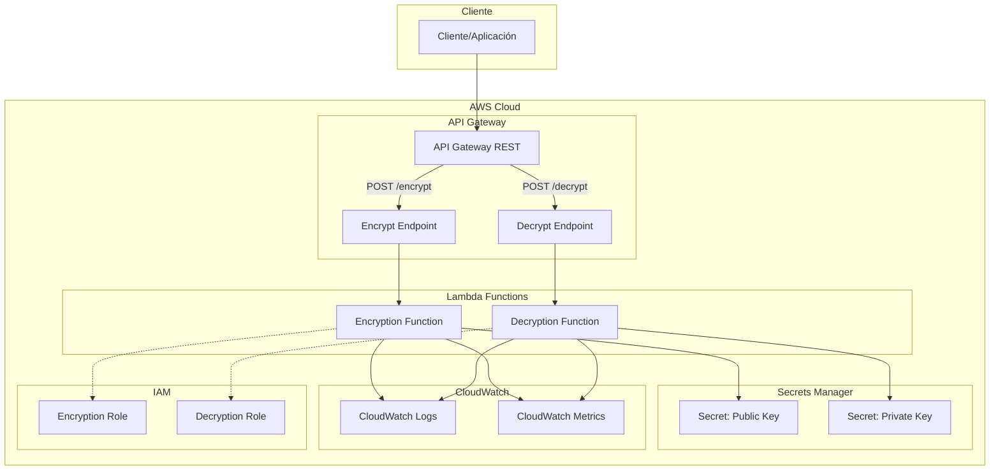

# Infraestructura y Despliegue - Lambda Encryption/Decryption

Este documento describe la infraestructura AWS y los procesos de despliegue para el sistema de encriptación/desencriptación Lambda.

## Arquitectura de Infraestructura

### Componentes AWS



### Recursos Creados

| Recurso | Tipo | Propósito |
|---------|------|-----------|
| `EncryptionFunction` | AWS::Serverless::Function | Función Lambda de encriptación |
| `DecryptionFunction` | AWS::Serverless::Function | Función Lambda de desencriptación |
| `ApiGateway` | AWS::Serverless::Api | API REST para exponer las funciones |
| `EncryptionLogGroup` | AWS::Logs::LogGroup | Logs de la función de encriptación |
| `DecryptionLogGroup` | AWS::Logs::LogGroup | Logs de la función de desencriptación |
| IAM Roles | AWS::IAM::Role | Roles de ejecución para las funciones |
| IAM Policies | AWS::IAM::Policy | Permisos para acceder a Secrets Manager |

## Configuración de Infraestructura

### Parámetros del Template

```yaml
Parameters:
  Environment:
    Type: String
    Default: dev
    AllowedValues: [dev, staging, prod]
    
  KeyId:
    Type: String
    Description: ID de la clave RSA en Secrets Manager
    Default: lambda-encryption-key
    
  LogLevel:
    Type: String
    Default: INFO
    AllowedValues: [DEBUG, INFO, WARN, ERROR]
```

### Variables de Entorno Automáticas

Las siguientes variables se configuran automáticamente:

```yaml
Environment:
  Variables:
    LOG_LEVEL: !Ref LogLevel
    AWS_REGION: !Ref AWS::Region
    KEY_ID: !Ref KeyId
    FUNCTION_TYPE: encryption|decryption
```

### Configuración de Funciones Lambda

```yaml
Globals:
  Function:
    Timeout: 30                    # 30 segundos máximo
    MemorySize: 512               # 512 MB de memoria
    Runtime: nodejs18.x           # Node.js 18.x
    Architectures: [x86_64]       # Arquitectura x86_64
```

## Permisos IAM

### Función de Encriptación

```json
{
  "Version": "2012-10-17",
  "Statement": [
    {
      "Effect": "Allow",
      "Action": [
        "secretsmanager:GetSecretValue"
      ],
      "Resource": "arn:aws:secretsmanager:*:*:secret:${KeyId}-public-*"
    },
    {
      "Effect": "Allow",
      "Action": [
        "logs:CreateLogGroup",
        "logs:CreateLogStream", 
        "logs:PutLogEvents"
      ],
      "Resource": "arn:aws:logs:*:*:log-group:/aws/lambda/*"
    }
  ]
}
```

### Función de Desencriptación

```json
{
  "Version": "2012-10-17",
  "Statement": [
    {
      "Effect": "Allow",
      "Action": [
        "secretsmanager:GetSecretValue"
      ],
      "Resource": "arn:aws:secretsmanager:*:*:secret:${KeyId}-private-*"
    },
    {
      "Effect": "Allow",
      "Action": [
        "logs:CreateLogGroup",
        "logs:CreateLogStream",
        "logs:PutLogEvents"
      ],
      "Resource": "arn:aws:logs:*:*:log-group:/aws/lambda/*"
    }
  ]
}
```

## Scripts de Automatización

### 1. Build Script (`scripts/build.sh`)

**Propósito**: Compilar TypeScript y empaquetar funciones Lambda

**Funcionalidades**:
- Compilación de TypeScript a JavaScript
- Instalación de dependencias de producción
- Creación de packages ZIP para cada función
- Generación de checksums y metadatos
- Validación de tamaños de package

**Uso**:
```bash
# Build básico
./scripts/build.sh

# Build con npm
npm run build:lambda

# Build en Windows
npm run build:lambda:win
```

**Salidas**:
- `dist/`: Código compilado para SAM
- `lambda-packages/`: Archivos ZIP para despliegue directo
- `lambda-packages/build-info.json`: Metadatos del build

### 2. Deploy Script (`scripts/deploy.sh`)

**Propósito**: Desplegar infraestructura usando AWS SAM

**Funcionalidades**:
- Validación de prerequisitos
- Verificación de claves en Secrets Manager
- Despliegue usando CloudFormation
- Configuración de parámetros por entorno
- Obtención de outputs del stack

**Uso**:
```bash
# Despliegue en desarrollo
npm run deploy:dev

# Despliegue en staging con confirmación
npm run deploy:staging

# Despliegue en producción con confirmación
npm run deploy:prod

# Despliegue personalizado
./scripts/deploy.sh -e prod -r us-west-2 -k my-key -b -c
```

### 3. Key Generation Script (`scripts/generate-keys.js`)

**Propósito**: Generar claves RSA en formato JWK

**Funcionalidades**:
- Generación de pares de claves RSA
- Conversión a formato JWK
- Creación de metadatos
- Generación de comandos AWS CLI

**Uso**:
```bash
# Generar claves con configuración por defecto
node scripts/generate-keys.js

# Generar claves personalizadas
node scripts/generate-keys.js --key-id my-key-2024 --key-size 4096
```

## Entornos de Despliegue

### Desarrollo (dev)

**Características**:
- Configuración mínima de seguridad
- Logs detallados (DEBUG)
- Sin rotación de claves
- Recursos compartidos

**Configuración**:
```bash
Environment=dev
LogLevel=DEBUG
KeyId=lambda-encryption-key-dev
```

### Staging (staging)

**Características**:
- Configuración similar a producción
- Logs informativos (INFO)
- Rotación de claves opcional
- Recursos dedicados

**Configuración**:
```bash
Environment=staging
LogLevel=INFO
KeyId=lambda-encryption-key-staging
```

### Producción (prod)

**Características**:
- Máxima seguridad
- Logs mínimos (WARN/ERROR)
- Rotación automática de claves
- Recursos dedicados y monitoreados

**Configuración**:
```bash
Environment=prod
LogLevel=WARN
KeyId=lambda-encryption-key-prod
```

## Monitoreo y Observabilidad

### CloudWatch Logs

**Grupos de Logs**:
- `/aws/lambda/${StackName}-encryption-${Environment}`
- `/aws/lambda/${StackName}-decryption-${Environment}`

**Retención**: 14 días (configurable)

**Formato de Logs**:
```json
{
  "timestamp": "2024-01-15T10:30:00.000Z",
  "level": "INFO",
  "requestId": "abc-123-def-456",
  "functionName": "encryption",
  "message": "Encryption completed successfully",
  "duration": 150,
  "memoryUsed": 45
}
```

### CloudWatch Metrics

**Métricas Estándar**:
- `Invocations`: Número de invocaciones
- `Duration`: Tiempo de ejecución
- `Errors`: Número de errores
- `Throttles`: Invocaciones limitadas
- `ConcurrentExecutions`: Ejecuciones concurrentes

**Métricas Personalizadas**:
- `EncryptionSuccess`: Encriptaciones exitosas
- `DecryptionSuccess`: Desencriptaciones exitosas
- `KeyRetrievalTime`: Tiempo de recuperación de claves
- `PayloadSize`: Tamaño de payloads procesados

### Alarmas Recomendadas

```bash
# Alarma por errores
aws cloudwatch put-metric-alarm \
  --alarm-name "Lambda-Encryption-Errors-${Environment}" \
  --alarm-description "Errores en funciones de encriptación" \
  --metric-name Errors \
  --namespace AWS/Lambda \
  --statistic Sum \
  --period 300 \
  --threshold 5 \
  --comparison-operator GreaterThanThreshold

# Alarma por latencia
aws cloudwatch put-metric-alarm \
  --alarm-name "Lambda-Encryption-Duration-${Environment}" \
  --alarm-description "Latencia alta en funciones de encriptación" \
  --metric-name Duration \
  --namespace AWS/Lambda \
  --statistic Average \
  --period 300 \
  --threshold 5000 \
  --comparison-operator GreaterThanThreshold
```

## Seguridad

### Gestión de Claves

**Secrets Manager**:
- Claves almacenadas en formato JWK
- Cifrado en reposo con KMS
- Rotación automática opcional
- Auditoría de accesos

**Separación de Claves**:
- Clave pública: Solo función de encriptación
- Clave privada: Solo función de desencriptación
- Principio de mínimo privilegio

### Network Security

**VPC (Opcional)**:
```yaml
VpcConfig:
  SecurityGroupIds:
    - sg-12345678
  SubnetIds:
    - subnet-12345678
    - subnet-87654321
```

**Endpoints VPC**:
- Secrets Manager VPC Endpoint
- CloudWatch Logs VPC Endpoint

### Compliance

**Logging**:
- No se registran datos sensibles
- Sanitización automática de logs
- Retención configurable

**Auditoría**:
- CloudTrail para llamadas a API
- CloudWatch para métricas de función
- Secrets Manager para acceso a claves

## Costos

### Estimación de Costos (us-east-1)

**Lambda**:
- Requests: $0.20 por 1M requests
- Duration: $0.0000166667 por GB-second
- Ejemplo: 1M requests/mes, 500ms avg, 512MB = ~$10/mes

**API Gateway**:
- REST API: $3.50 por 1M requests
- Ejemplo: 1M requests/mes = $3.50/mes

**Secrets Manager**:
- Secret storage: $0.40 por secret por mes
- API calls: $0.05 por 10,000 calls
- Ejemplo: 2 secrets, 100K calls/mes = $1.30/mes

**CloudWatch**:
- Logs ingestion: $0.50 per GB
- Logs storage: $0.03 per GB per month
- Ejemplo: 1GB logs/mes = $0.53/mes

**Total Estimado**: ~$15-20/mes para 1M requests

### Optimización de Costos

1. **Provisioned Concurrency**: Solo para producción
2. **Log Retention**: Reducir a 7 días en dev
3. **Memory Allocation**: Ajustar según uso real
4. **Reserved Capacity**: Para cargas predecibles

## Troubleshooting

### Problemas Comunes

#### 1. "Secret not found"
```bash
# Verificar que el secret existe
aws secretsmanager describe-secret --secret-id ${KeyId}-public

# Verificar permisos IAM
aws iam simulate-principal-policy \
  --policy-source-arn ${LambdaRoleArn} \
  --action-names secretsmanager:GetSecretValue \
  --resource-arns ${SecretArn}
```

#### 2. "Function timeout"
```bash
# Revisar logs de CloudWatch
aws logs filter-log-events \
  --log-group-name "/aws/lambda/${FunctionName}" \
  --filter-pattern "TIMEOUT"

# Aumentar timeout si es necesario
aws lambda update-function-configuration \
  --function-name ${FunctionName} \
  --timeout 60
```

#### 3. "Memory exceeded"
```bash
# Revisar uso de memoria
aws logs filter-log-events \
  --log-group-name "/aws/lambda/${FunctionName}" \
  --filter-pattern "Memory"

# Aumentar memoria asignada
aws lambda update-function-configuration \
  --function-name ${FunctionName} \
  --memory-size 1024
```

### Herramientas de Diagnóstico

#### 1. AWS X-Ray (Opcional)
```yaml
Tracing: Active
```

#### 2. Enhanced Monitoring
```yaml
ReservedConcurrencyProvisionedConcurrencyConfig:
  ProvisionedConcurrencyExecutions: 10
```

#### 3. Dead Letter Queue
```yaml
DeadLetterQueue:
  Type: SQS
  TargetArn: !GetAtt DeadLetterQueue.Arn
```

## Backup y Recuperación

### Backup de Claves

```bash
# Backup de secrets
aws secretsmanager get-secret-value \
  --secret-id ${KeyId}-public \
  --query SecretString \
  --output text > backup-public-key.json

aws secretsmanager get-secret-value \
  --secret-id ${KeyId}-private \
  --query SecretString \
  --output text > backup-private-key.json
```

### Recuperación de Desastres

1. **Backup del código fuente**: Git repository
2. **Backup de la infraestructura**: Template SAM
3. **Backup de las claves**: Secrets Manager + backup local
4. **Backup de la configuración**: Parámetros del stack

### Procedimiento de Recuperación

```bash
# 1. Restaurar claves
aws secretsmanager create-secret \
  --name ${KeyId}-public \
  --secret-string file://backup-public-key.json

# 2. Redesplegar infraestructura
./scripts/deploy.sh -e prod -b

# 3. Verificar funcionamiento
node examples/test-functions.js --api-url ${ApiUrl}
```

---

Esta documentación proporciona una guía completa para la gestión de la infraestructura del sistema de encriptación/desencriptación Lambda. Para más detalles sobre el despliegue, consultar [DEPLOYMENT.md](./DEPLOYMENT.md).